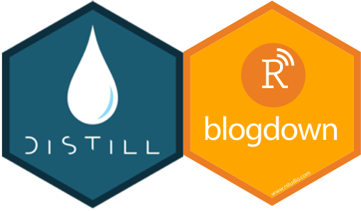

```{r setup, include=FALSE}
knitr::opts_chunk$set(echo = FALSE)
```
**Tl;dr**
<ru>
  <li>Watch someone else do it first.</li>
  <li>Establish working repository (Github).</li>
  <li>Plan the design (website, blog, both?).</li>
  <li>Add content and personalize.</li>
  <li>Deploy (Github, Netlify, personal domain, all 3?).</li>
</ru>

This project began as an assignment for grad school. I'm currently in my second semester of an instructional design M.Ed. program at [NC State University](https://online-distance.ncsu.edu/program/master-of-science-in-learning-design-and-technology/). One of the graduation requirements is to produce an online portfolio describing my coursework and projects. The portfolio will become a jumping off point for my professional life and a place where I can showcase my work to potential employers or peers that wish to collaborate. The initial requirements for the assignment were fairly basic: set up a webpage with a framework that I'd fill in as I progress through the program. I did all that in a couple of hours during my introductory course last summer. You can see that initial effort here: <https://jmhardaw.wordpress.ncsu.edu/>. Everybody say, "Good job, James." 💪

Seriously, though, it was a simple assignment. The site was built through [Wordpress](https://wordpress.com/), using one of their many free themes. As a student, I have access to free webhosting through the university, hence the page residing on the NCSU.edu domain. I quickly recognized a potential challenge once I left school...would I have to move or recreate my site on another domain? Additionally, having used Wordpress for a couple of years on other projects, I know I will eventually get bored with the chosen theme while running into barriers to personalization. For this portfolio, I really want to make it mine and not scripted according to a finite set of theme boundaries. I don't (yet) know much about HTML, so eventually I'm going to run into a creative wall limiting me to the defaults inherent to my chosen theme.

::: float-left

While these thoughts bounced around my brain housing group, I began exploring the world of coding in 'R.' As part of my grad program, I'm working on a Learning Analytics certificate comprised of four courses focused on various dimension of data science in the education field. The coding environment predominantly used in these courses is that of 'R.' Per the [R-Project](https://www.r-project.org/about.html) homepage, R is an open-source language and coding environment for statistical computing and graphics. In addition to being able to create extensive visuals, it can publish almost effortlessly to a wide variety of formats including HTML. Entire books are authored online with 'R' as well as many creative websites, most focused on using R in statistics. I decided to marry the portfolio requirement to learning a new coding language and here we are. I'm going to build a website, pretty much from scratch, in a language that I don't yet understand. Good plan, James. 🤦
:::
## Watch and Learn
::: float-left

Like I do with most things new, nerdy, and technical, I just dove in. Instructional manual? Nope. Ask questions? Who's got time for that? I'm ready to produce now! Yeah...that mindset lost me a day with zero to show for it. Won't bore you with the details of what I did wrong, exactly, but it was just about everything. Day 2 started with a search for someone what had already done this successfully. Wow, there are a lot of you out there! The video I found incredibly easy to watch and follow came from [Dr. Maria Tackett](https://mariatackett.net/). She gave this [presentation](https://youtu.be/RYf5HqU1pI4) as part of the [R-Ladies Baltimore meetup](https://www.meetup.com/rladies-baltimore/) in the spring of 2021. The hour-long tutorial was perfect for a rookie like me to understand step-by-step how to begin my project. Her insights led me to choose the [Distill package](https://pkgs.rstudio.com/distill) over the [Blogdown](https://pkgs.rstudio.com/blogdown/)/[Hugo](https://gohugo.io/) mashup due to simplicity. Distill is just easier and more straightforward. While I knew I'd be sacrificing some creative capabilities, I felt Distill gave me the best shot at seeing quickly how well I could use R to produce a portfolio sight to meet my needs. If you want to compare capabilities, visit the page of [Dr. Malcolm Barrett](https://malco.io/), a data scientist in Los Angeles, CA. He built his using the Blogdown package and a Hugo theme.
:::
## The Git Repo
::: float-left

Before diving into a build, users need a spot to store or "host" their content. Many options are available as I referenced earlier with Wordpress sites, university-provided webhosting, etc. In the data science community, [GitHub](https://github.com/) is a well-known, free code hosting and collaboration platform that allows you access to great work from other users. In addition to acting as a repository (or repo) for your data, you can view how others built their content at the code level. Jackpot. 🎰  The git repo for my site is [here](https://github.com/jmhardaw/LDT-portfolio), but you can also see other projects I'm working as I have multiple repos. With a GitHub account, users have a way to move products from their desktop to a repo to update their site. This can be done directly through the [RStudio desktop](https://happygitwithr.com/rstudio-git-github.html) or a [GitHub desktop application](https://desktop.github.com/) (my current method). With a home base established, let's get to the build!
:::
## The Framework

Distill gives users the basic build choice between a website or a blog, with each of these choices determining how the initial framework is set. That said, I've discovered you can modify this somewhat if you decide after the fact that you want one vs the other or a little of both (like me). I went with the website and then added a blog page after the fact. This was easy to do...once I figured out how Distill builds its functional pages. The pages within a Distill website are called "articles" and are formatted differently than a blog page. The key to a Distill site is how each page is identified. Your base home page or "index" page will carry the "website" moniker, while other pages are either "articles" or "list" pages (blogs). The "list" pages connect to your individual blog "posts."

I'll pause here to acknowledge some great resources I found that gave me some additional pointers to get the site off the ground. First was a [blog
article](https://distillery.rbind.io/posts/2020-07-31-building-a-blog-with-distill/) posted by [Dr. John Helveston](https://www.jhelvy.com/) on his personal webpage that was also built with the Distill package. That article was not only incredibly insightful, but it introduced me to [The Distillery](https://distillery.rbind.io/). This site exists to help users better understand how to employ the Distill package while also showcasing some examples of others' websites. Another great tool is the [Distill for Markdown](https://rstudio.github.io/distill/) article hosted by [RStudio](https://www.rstudio.com/products/rstudio/). The base page explains how to create a Distill article and you can go to a dropdown menu for similar pages on creating websites and blogs. From these first few resources, I felt confident I could technically produce a site. But to make it unique? I needed ideas. Back to the Distillery I went and discovered some amazing examples feeding my need to set my site apart from the crowd. Below are the key designers that inspired me.

<center></center>

The first site that caught my eye was the homepage for [Dr. Joel Nitta](https://www.joelnitta.com/), a project research associate out of Tokyo. His intro page is a very clean, but informative snapshot of who he is and what he does. As I soon learned, this style of landing page is quite common on Distill sites as it is built with the [postcards package](https://github.com/seankross/postcards) that integrates well with Distill. The package contains five distinct themes that allow the user a variety of layouts for their introduction page. Dr. Nitta's specific theme is "trestles." My "About Me" page took this theme, so you should see some similarities. For many sites, this bio page becomes their landing page or "index" page and is the first thing you see. I did this too for the first few iterations of my published site. Eventually I created a different landing page that scaled to my different interests and took my site a bit beyond just creating a digital portfolio for grad school. More on that later. The next site that caught my eye was that of [Dr. Andreas
Handel](https://www.andreashandel.com/), a Professor at the University of Georgia. His article on [building a website in less than 30 minutes](https://www.andreashandel.com/posts/distill-github-website/) was filled with helpful tips, but he also had some great design in his projects and subscribe pages. On his blog, I saw a way to integrate user feedback and comments. Dr. Handel went with the [utteranc.es](https://utteranc.es/) widget which conveniently links to his GitHub repo. For users to comment, though, they must log into their own GitHub accounts before commenting. I'm currently steering away from this as I don't want to limit feedback to only data science folks. I ended up going with a [disqus](https://disqus.com/) comment plug-in as it allows anyone to comment on my blog posts without first logging in. While this allows some anonymity, I'm ok with that if it reduces barriers to communication. I did have to set up a disqus user account, but it was free. Finally, the site of [Dr. Emi Tanaka](https://emitanaka.org/), a university lecturer out of Australia, intrigued me mainly because of her unique landing page. I knew I wanted to stray from the standard bio page and hers was built on sections you could easily change giving the site less of a static feel. She also incorporated a right sidebar with an active twitter widget. If you scroll through my page, you'll see I took many of my ideas from a combination of what I found successfully employed on other sites.

## The Content

The foundation of my site was built around three pages: bio, grad school coursework, and a blog. Completing the contents on these pages was enough to see the site "live" and get a sense for what was possible. These pages would also meet the basic requirements for my digital portfolio assignment. As referenced earlier, the design of my bio page was taken from Dr. Nitta's [page](https://www.joelnitta.com/), while my coursework and blog pages closely match what I saw on Dr. Helvy's [teaching](https://www.jhelvy.com/teaching.html) and [blog](https://www.jhelvy.com/blog.html) pages. Additionally, my color scheme was taken from Dr. Helvy as well. Eventually I will probably change that, but his colors work, so no rush! I knew I would need to expand my coursework effort to include a "projects" page. Dr. Helvy has a great one as well. It's unique in that it pulls data from a .csv file (spreadsheet) resident in his repo. Instead of updating the webpage every time a project is ready to showcase, I only update the spreadsheet and upload it to GitHub.

The "veteran resource" page was one of my last adds before I designed the new landing page. I work with current and former service members on campus, and I wanted a single spot they could go to access resources applicable to a veteran in college. That will be a living page that gets updated often. The landing page was the toughest to engineer. I wanted an introductory page that dynamically brought the visitor into all the efforts I'm involved with while providing an opportunity to interact on a more personal level. Currently, that's being served by the top banner, calendar events and social media widget, but it could grow. Dr. Tanaka's site was one of the few that had a distinct landing page separate from her bio/resume page. I found that inviting and copied some of her great ideas. Over time I added some small features like a visitor counter and a subscribe widget on the blog page. Fairly simple once I saw how others had integrated the code. Finally, it was time to make it live.

## Deploy
::: float-left

Lots of options. Initially I chose the simplest which is to deploy straight from [GitHub pages](https://pages.github.com/). Again, it's free. You won't get a sexy domain name as it's basically the name of your git repo, but it works seamlessly. Another free option is to go through [Netlify](https://www.netlify.com/) which gives you the ability to customize your domain name a little better than on GitHub. It will still contain a Netlify prefix though. Lastly, you can use a personal domain name that you've purchased. This gives you the ultimate flexibility in naming convention because you own the site. There are ways to go directly between your hosting service (I use [Bluehost](https://www.bluehost.com/)) and your Git repo, but for me it was a bit simpler to use Netlify as a middleman between the two. Doing this could take up to 24 hours to go live the first time, but updates happen very quickly thereafter (minutes).
:::
## Work Left to Do

My goal for the project was to deploy a digital portfolio built in 'R' over the winter break. I'm happy to report that mission accomplished. I got introduced to 'R' last summer, so it's fair to say I'm no expert at this language. I've also had to dabble a little bit in HTML and CSS. Thankfully, the 'R' coding community is very open and willing to share good ideas with the noobs like me. It's been frustrating at times, but I have yet to see a problem that someone else hasn't already experienced and developed a solution. I've also learned that themes aren't evil! If you find one that suits you, then use it. Or start there and make it better. I'm looking forward to seeing the site grow as I get deeper into my grad school program. I'm also convinced there will be a time where I'll want to completely re-design it or add new capabilities...maybe after grad school... That's enough for this post as I've got one last weekend of winter break. Time for the [NerdyGI](https://www.nerdygi.com) to find some snow! ❄️
