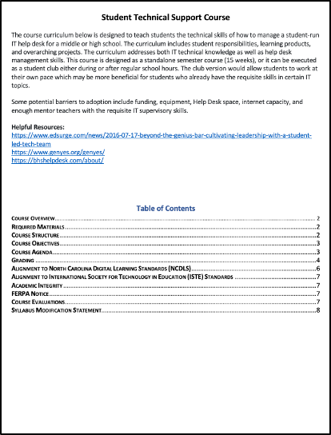

```{r setup, echo=FALSE}
knitr::opts_chunk$set(echo = FALSE)
```

## Executive Overview

<p>

The portfolio below captures the coursework I've completed toward developing skills in a systems approach to instructional design. This approach, weighted heavily in data-informed decision-making, places emphasis on empowering students as they drive the pace and scope of their learning journey. Today's digital learning networks are individualized and networked, while also existing both locally and globally. This educational environment requires learners to be as comfortable in the digital world as they are in the physical classroom. The course and artifact summaries below depict how I used these realities as a blueprint to develop knowledge and skills in guiding K-12, post-secondary, and even industry education programs to realize positive individual and organizational growth through effective technology integration.

</p>

<p>

While I frontloaded the Learning Analytics certificate courses into my first fall and spring semesters, I attempted to spread the design and leadership courses across multiple semesters to better diversify my personal learning network throughout the program. This allowed me to take insights from design and leadership classes and apply them to my core work on analytics and inquiry. As a result, my foundation in data science was better informed by the challenges faced in developing and delivering quality content for the modern digital classroom. To this end, my inquiry projects focused on exploring the challenges of critical thinking, digital and media literacy, evaluation metrics, and communication across learning networks. The key insights I'm taking from how I organized my learning is that today's education space is overwhelmingly digital, it's social, and it's evolving.

</p>

<p>

The digital nature of education is producing a ton of data. While this can be overwhelming if an organization is unprepared, the LA program instilled a data science mindset to solve these types of challenges. From identifying and collecting the right data to understanding its potential significance, and finally, to developing models to solve increasingly complex problems, my experience through the core coursework and the summer internship provided multiple repetitions to engage these methods as well as develop relationships with more experienced practitioners.

</p>

<p>

Participating in this program post-pandemic allowed me to benefit from many of my peers' experiences in hybrid learning environments. From equipment and infrastructure shortfalls to learner anxieties about being on camera, I got to hear firsthand how some districts/programs rose to the occasion while others floundered. In both cases, not all students had the same experiences as their peers next to them in class or online. The digital divide is real and not just happening in rural communities. Last spring, I participated in the datathon hosted by NCSU and the Governor's office. That experience opened my eyes to the lack of digital reach and equity across our state. Part of that challenge is recognizing how technology, connectivity infrastructure, and socioeconomics all combine to impact individual students very differently. District and state educational leaders must develop a strategic vision of how to apply resources to ensure each student has the same opportunities regardless of location or personal situation.

</p>

<p>

The portfolio is depicted chronologically as I took the courses beginning in the Summer of 2021. Each entry contains a brief description of the course purpose, expected outcomes, and requirements. Also included are key artifacts contributing to my learning goals as well as some examples of additional classwork.

</p>

## [ECI 511: Introduction to Learning Design and Technology](http://catalog.ncsu.edu/search/?P=ECI%20511)

::: float-left


This course provided an overview of the Learning, Design, and Technology master's program at NC State University and to the field of instructional design and educational technology, with an investigation of relevant careers, important theories and models guiding practice, and noteworthy research findings by area. Learning activities included reading assignments, design projects, videos, discussion forums, and individual projects. Students were assessed through asynchronous discussions, online participation, and homework assignments.

<p>

**Key Artifact**:

[Annotated Bibliography - Digital Literacy](https://github.com/jmhardaw/LDT-portfolio/blob/main/content/eci511-artifacts/ECI511-annotated-bibliography.pdf)

[](https://github.com/jmhardaw/LDT-portfolio/blob/main/content/eci511-artifacts/ECI511-annotated-bibliography.pdf)

This assignment was one of the final projects for my introduction to learning design. The annotated bibliography helped develop my inquiry and research skills as it required me to evaluate the quality of each of the selected resources. As we were allowed to select our own research topic, I focused on how digital literacy impacts learning design methodologies. My goal was to hone my skills at discriminating between relevant, meaningful sources and those that were not. I chose to explore both Google Scholar and the NC State library to increase the chances of locating quality articles. Though the project scope was limited to only five annotations, this assignment greatly helped in developing my initial research interest in digital literacy. The main takeaway from this review reinforced that students who are more interested in the learning material, show a greater desire to increase their digital literacy skills. While short, the review implied a link between quality learning technology integration and digital literacy aptitude.

</p>
:::

<aside>

**Semester Completed**:

-   Summer II 2021

**Instructor**:

-   [Dr. Julia McKeown](https://ced.ncsu.edu/people/jomckeow/)

**Additional Coursework**:

-   [Zoom Training Video](https://www.youtube.com/watch?v=YDljgFQVcOk)
-   [Project - State Park Employee Training Program](https://github.com/jmhardaw/LDT-portfolio/blob/main/content/eci511-artifacts/ECI511-design-project.pdf)

</aside>

`r htmltools::br()`

## [ECI 517: Theoretical Foundations of Advanced Learning Environments](http://catalog.ncsu.edu/search/?P=ECI%20517)

::: float-left


This course provided us with the distinctions and concepts necessary to apply various theories of learning, cognition, and instruction to traditional and distance learning settings. This course introduced and illustrated the proper use of these tools in providing insights into defining and solving problems. The emphasis was on the use of these theories to solve realistic and relevant problems drawn from my personal experience or from cases we studied. Learning activities included reading assignments, design projects, videos, discussion forums, and individual projects.

::: float-left
<p>

**Key Artifact**:

[Final Theory Paper - Agency Drives Growth](https://github.com/jmhardaw/LDT-portfolio/blob/main/content/eci517-artifacts/ECI517-final-theory-paper.pdf)

[{width="200"}](https://github.com/jmhardaw/LDT-portfolio/blob/main/content/eci517-artifacts/ECI517-final-theory-paper.pdf)

This theory paper completed my 15-week journey to better understand which instructional design theories I would pull from to develop my personal learning model. Early in the semester, I wrote my initial thoughts on learning, so this was a follow-up based on almost 4 months of instructional design theory from the past 100 years or so. This course presented opportunities to explore my own thoughts, feelings, and biases on how teachers affect the relationship between their students and the institution of education. Beyond teaching students how to understand the world around them, educators shape individual trajectories by reinforcing scholarship as a lifelong adventure most often occurring outside the traditional classroom. This paper reflects how my views on instruction shifted from focusing on learning capability to a more systems perspective of how learners grow as their environment changes. I'm firmly planted in the constructivist camp, which was seen through the learning network diagram I developed as well as the pillars of my learning theory: self-aware, ownership (agency), complexity, multi-mode, and collaboration.

</p>
:::
:::

<aside>

**Semester Completed**:

-   Fall 2021

**Instructor**:

-   [Dr. Julia McKeown](https://ced.ncsu.edu/people/jomckeow/)

**Additional Coursework**:

-   [Initial Learning Theory Paper](https://github.com/jmhardaw/LDT-portfolio/blob/main/content/eci517-artifacts/ECI517-initial-theory-paper.pdf)
-   [Reflexive Essay - Theories of Learning & Instruction](https://github.com/jmhardaw/LDT-portfolio/blob/main/content/eci517-artifacts/ECI517-reflexive-paper.pdf)
-   [Application Essay - An Intro to R](https://github.com/jmhardaw/LDT-portfolio/blob/main/content/eci517-artifacts/ECI517-application-paper.pdf)

</aside>

`r htmltools::br()`

## [ECI 586: Introduction to Learning Analytics\*](http://catalog.ncsu.edu/search/?P=ECI%20586)

::: float-left


Learning Analytics (LA) has emerged over the past decade as an interdisciplinary field encompassing Learning (e.g. educational technology, learning and assessment sciences), Analytics (e.g. visualization, computer/data sciences), and Human-Centered Design (e.g. usability, participatory design). This course provided an overview of the field, examples of its use in educational contexts, and applied experience with widely adopted tools and techniques for working with and exploring data. As I gained experience in the collection, analysis, and reporting of data throughout the course, I became much better prepared to help educational organizations understand and improve learning and the contexts in which learning occurs.

::: float-left
<p>

**Key Artifact**:

[Final Project - Benchmarking Fake News](https://rpubs.com/jmhardaw/FinalProject_ECI586)

[{width="200"}](https://rpubs.com/jmhardaw/FinalProject_ECI586)

My introduction to data science and programming culminated in this project testing the ability of text mining algorithms to recognize misinformation in media and classify those news sources accordingly. This assignment challenged my notion of "fake news" as rarely is a news article, regardless of source, all true or all false. Misinformation (a clearer description) is more nuanced and is usually captured in the context of what was left out, or small details that can't be verified as fact. While mistruths can be found, the sentiment of articles is a better barometer of an article and potentially a media organization's biases. This assignment reinforced the importance of collecting good data (sourcing), cleaning and ingesting the data effectively (wrangling), exploring the data to identify patterns (analyzing), classifying the articles based on these patterns into specific categories (modeling), and finally reporting data-based findings (communicating). Using these five basic steps in each case study and this project instilled respect for the data science process to ensure my results were repeatable, even if the data were to change.

</p>
:::
:::

<aside>

**Semester Completed**:

-   Fall 2021

**Instructor**:

-   [Dr. Shaun Kellogg](https://ced.ncsu.edu/people/sbkellog/)

**Additional Coursework**:

-   [Case Study: Predicting Student Achievement](https://rpubs.com/jmhardaw/StudentAchieve)
-   [Case Study: Identifying At-Risk Students](https://rpubs.com/jmhardaw/At-risk-students)
-   [Shiny App Exercise: Class Enrollment & Gender](https://ps53zd-james-hardaway.shinyapps.io/class-attendance/)
-   [Case Study: Public Sentiment & State Standards](https://rpubs.com/jmhardaw/sentiment-analysis)

</aside>

`r htmltools::br()`

## [ECI 587: Machine Learning in Education\*](http://catalog.ncsu.edu/search/?P=ECI%20587)

::: float-left
[{width="200"}](https://wordstream-files-prod.s3.amazonaws.com/s3fs-public/machine-learning.png)

Machine Learning is concerned with computer programs that enable the behavior of a computer to be learned from examples or experience rather than dictated through rules written by hand. This class taught the practical side of machine learning for applications in mining educational data. We covered a wide range of learning algorithms that can be applied to a variety of educational problems. In particular, we discussed topics such as decision trees, rule-based classification, support vector machines, Bayesian networks, and clustering. In addition to readings from the course textbook, the course had a heavy project focus to develop practical skills.

::: float-left
<p>

**Key Artifact**:

[Final Project - Identifying Misinformation in the Media](https://github.com/jmhardaw/LDT-portfolio/blob/main/content/eci587-artifacts/eci587-final-project.pdf)

[{width="200"}](https://github.com/jmhardaw/LDT-portfolio/blob/main/content/eci587-artifacts/eci587-final-project.pdf)

This final machine learning project was the culmination of about a month of research and experimentation using a couple of software tools to explore the potential for automated machine learning tools to recognize misinformation in online news media. Using a dataset of 6000 news articles, this study demonstrated how various textual features could be extracted to build algorithms that learned to recognize fake news. Since my data was labeled as either "fake" or "real" prior to modeling, I used supervised learning to train the model on how to recognize which category best fit the articles. In addition to exploring how feature space drives model training, this project reinforced the importance of data engineering prior to experimentation. I learned how to identify whether a dataset is contaminated with information that could cause the algorithm to "overfit" the data delivering results that weren't generalizable to broader contexts. While the technology was up to the task of identifying biased articles, the results were primarily driven by dataset quality.

</p>
:::
:::

<aside>

**Semester Completed**:

-   Fall 2021

**Instructor**:

-   [Dr. Shiyan Jiang](https://ced.ncsu.edu/people/sjiang24/)

</aside>

`r htmltools::br()`

## [ECI 516: Design and Evaluation of Instructional Materials](http://catalog.ncsu.edu/search/?P=ECI%20516)

::: float-left


This course introduces us to the systems approach to instructional design and provided introductory information and application of skills and techniques necessary in the analysis, design, development, implementation, and evaluation of instruction (often referred to as the ADDIE framework). These skills are particularly useful for efficient and cost-effective development of solutions to novel instructional problems. The emphasis was on the development of materials-centered instruction (as opposed to teacher-mediated), that is, materials and resources that are developed to be the primary means by which instruction is delivered. Contrasting views and perspectives of instructional design were also considered, such as those based on very different learning philosophies (such as objectivism and constructivism).

::: float-left
<p>

**Key Artifacts**:

[Needs Analysis Proposal](https://github.com/jmhardaw/LDT-portfolio/blob/main/content/eci516-artifacts/ECI516-needs-analysis-proposal.pdf)

[{width="300"}](https://github.com/jmhardaw/LDT-portfolio/blob/main/content/eci516-artifacts/ECI516-needs-analysis-proposal.pdf)

This Needs Analysis Proposal explored the process of determining an organization's performance gaps and then designing an assessment methodology to capture insights into how best to decrease those gaps within the realities of time and budget. The paper discusses how to help an organization understand the difference between where it is and where it desires to be regarding specific performance goals. Once those targets are set, a cost-benefit analysis is conducted to highlight what's in the realm of the possible within the given time and budget. Once school leadership agrees on what's feasible, a plan can be constructed for resourcing and completing the needs analysis. This assignment reinforced the critical importance of identifying measurable performance gaps prior to implementing a technology or organizational solution. This process ensures that the right problems are being solved.

[Instructional Design Process Model](https://github.com/jmhardaw/LDT-portfolio/blob/main/content/eci516-artifacts/ECI516-isd-process-paper.pdf)

[{width="300"}](https://github.com/jmhardaw/LDT-portfolio/blob/main/content/eci516-artifacts/ECI516-isd-process-paper.pdf)

For this assignment, I designed an instructional design process model for a non-profit organization, exploring the need for non-educational entities to develop learning programs for their staff. To achieve this, I had to first conduct a systems analysis of the organization and its processes for delivering services. The resultant performance gaps informed the design management analysis detailing what needed to be learned, trained, and certified to meet their stated value proposition. Finally, a plan for executing the training was designed to ensure there was a regular feedback loop on how well the program was meeting its desired results. This systematic approach ensured that as the organization grew or lost members, the systems would still function properly as long as the training pipeline was enforced.

</p>
:::
:::

<aside>

**Semester Completed**:

-   Spring 2022

**Instructor**:

-   [Dr. Caitlin McKeown](https://moodle-courses2122.wolfware.ncsu.edu/user/view.php?id=28503&course=6365)

**Additional Coursework**:

-   [System Analysis Paper](https://github.com/jmhardaw/LDT-portfolio/blob/main/content/eci516-artifacts/ECI516-system-analysis-paper.pdf)

</aside>

`r htmltools::br()`

## [ECI 588: Text Mining in Education\*](http://catalog.ncsu.edu/search/?P=ECI%20588)

::: float-left


This introductory course to text mining was designed to prepare researchers and practitioners to use data more efficiently, effectively, and ethically. This course provided us with an overview of text mining as an analytical approach, examples of its use in educational contexts, and applied experience with widely adopted tools and techniques. As we gained experience in the collection, analysis, and reporting of data throughout the course, we became better prepared help educational organizations understand and improve both online and blended learning environments. We develop practical skills in the collection, analysis, and reporting of text data form sources such as Learning Management Systems, social media, and other online sources. Our projects were completed using a programming approach with R, a popular free open source software program for data science.

::: float-left
<p>

**Key Artifact**:

[Short Text Topic Modeling](https://rpubs.com/jmhardaw/eci588-final-project)

[{width="300"}](https://rpubs.com/jmhardaw/eci588-final-project)

The Short Text Topic Modelling assignment culminated my work in this course by combining lessons on text mining, topic modeling, and communicating results in a creative way to help users visualize relationships within the data. My research questions were driven by previous text mining projects that relied on incredibly large datasets. While it's understandable that intricate learning models require vast data to train them, I was on the search for a method that could reduce that workload on the front end and potentially open up additional, smaller resources that had previously been overlooked. Instead of a data model consuming entire papers or articles, I wanted to test whether it was possible to gain insights from key sentences or ideas within those documents. Turns out it can be done! Using article titles and taglines, I was able to generate quite accurate topic models charting technical research topics over time. My biggest challenges were finding the right data set and model that I could employ coding in R. I was able to find both, though there was only a single short text topic model designed to work well in R. That was enough, though, to show this could be done. The end result is a technique that could save researchers time in executing their text mining queries and topic models. This exercise exposed me to multiple databases that could be used for experiments but also highlighted that it's often better to curate your own data if you have specific research questions that few have worked on in the past.

</p>
:::
:::

<aside>

**Semester Completed**:

-   Spring 2022

**Instructor**:

-   [Dr. Shiyan Jiang](https://ced.ncsu.edu/people/sjiang24/)

**Additional Coursework**:

-   [Assessing Sentiment: #Python vs. #Rstats Tweets](https://rpubs.com/jmhardaw/python_vs_rstats)
-   [Topic Modeling: Amazon Book Reviews](https://rpubs.com/jmhardaw/eci-588-unit3-book-reviews)
-   [Word Net Analysis: Text Networks Predicting Wordle Success](https://rpubs.com/jmhardaw/eci588-unit-4-analysis)

</aside>

`r htmltools::br()`

## [ECI 589: Analyzing Learning Networks\*](http://catalog.ncsu.edu/search/?P=ECI%20589)

::: float-left


Although social network analysis and its educational antecedents date back to the early 1900s, the popularity of social networking sites like Twitter and Facebook have raised awareness of and renewed interests in networks and their influence. As the use of digital resources continues expand in education, data collected by these educational technologies has also greatly facilitated the application of network analysis to teaching and learning. This introductory course was designed to prepare education researchers and practitioners to apply network analysis to better understand and improve student learning and the contexts in which learning occurs. This course provided us with an overview of social network theory, examples of network analysis in educational contexts, and applied experience with widely adopted tools and techniques.

::: float-left
<p>

**Key Artifact**:

[Social Capital & Network Diffusion](https://rpubs.com/jmhardaw/eci589-unit5-walkthrough)

[{width="200" height="160"}](https://rpubs.com/jmhardaw/eci589-unit5-walkthrough)

This short case study explored the changes in student attitudes about STEM when interacting with other students. In this final regression analysis, the attitudes of people with whom a student engages impact their attitudes as well. In this case, three students were grouped with students that had lower attitude scores, which in turn dropped their own scores. Similarly, two students had relationships with students that had higher STEM attitude scores, raising their average STEM interest. That said, where a student starts (baseline score) is much more influential than the people they engage with. This is a great study on friend groups and how they could influence attitudes based on the number of network ties and the power of each individual relationship.

</p>
:::
:::

<aside>

**Semester Completed**:

-   Spring 2022

**Instructor**:

-   [Dr. Shaun Kellogg](https://ced.ncsu.edu/people/sbkellog/)

**Additional Coursework**:

-   [Visual & Numerical Description: School Administrator Centrality](https://rpubs.com/jmhardaw/eci589-unit2-analysis)
-   [Network Substructures: Comparing Out-degree Communications by Role in MOOC-Eds](https://rpubs.com/jmhardaw/eci-589-unit3-analysis)
-   [Predicting Network Phenomena: Collaboration Dependency on Trust & Gender for School Leaders](https://rpubs.com/jmhardaw/eci589-unit4-analysis)

</aside>

`r htmltools::br()`

## [ECI 515: Cultural Investigations and Technical Representations in Education](http://catalog.ncsu.edu/search/?P=ECI%20515)

::: float-left


This course took an anthropological-historical look at applying media and technology as resources and instruments to develop cultural awareness of self and others and to understand diverse cultures. The technology tools and media introduced encouraged us to explore cultural identity, values, and differences. The teaching strategies introduced are applicable across content areas and particularly relevant in social studies, English, world languages, and the arts.

::: float-left
<p>

**Key Artifacts**:

[Media Analyis on Climate Change](https://padlet.com/jmhardaw/ua1ccxxbu71uzb7b)

[{width="200"}](https://padlet.com/jmhardaw/ua1ccxxbu71uzb7b)

A primary goal of this assignment was to show how cultural topics are portrayed differently in media across sources, thus educating that the "truth" is not black or white or found in a random tweet or
meme, but rather open to broad interpretation. I chose the global warming debate as my topic, which really gained steam in the 1970s as large studies were commissioned by organizations such as the US National Academy of Sciences. The results of these studies were published in the late 70s/early 80s leading to a broader awareness of the issues. This awareness soon drove policy changes to be better stewards of the environment and the debate was on! For this padlet, I choose to look at media from four sources: YouTube, Twitter, Google Scholar, and the internet at large. From Google Scholar and the internet, I easily found
sources for each of the three positions (real, neutral, myth). YouTube was a little more challenging in that they have done a good job of removing most videos citing misinformation on the topic. While all three sides could be found on Twitter as well, the debate on that medium was often quite heated and probably the most negative of the four I researched.

[Personal Identity Text](https://arcg.is/1LDbz1)

[{width="200"}](https://arcg.is/1LDbz1)

In this project, I created an identity text that reflects on the evolution of my cultural identity. This artifact reinforces how everyone brings with them information from their background:
nationality, people, traditions, politics, language, religion, race, ethnicity, gender, economy, and more. These cultural elements influence us as people and likely as educators.

</p>
:::
:::

<aside>

**Semester**:

-   Fall 2022

**Instructor**:

-   [Dr. Florence Martin](https://ced.ncsu.edu/people/fmartin3/)

**Additional Coursework**:

-   [Global Project Plan: Government Accessibility](https://github.com/jmhardaw/LDT-portfolio/blob/main/content/eci515-artifacts/ECI515_Government_Accessibility.pdf)

</aside>

`r htmltools::br()`

## [ECI 518: Digital Learning Program and Staff Development](http://catalog.ncsu.edu/search/?P=ECI%20518)

::: float-left


This course comprised the study and application of principles related to digital learning program planning, facilities and resource management, and staff development in K-12 settings. It was designed to help prepare future technology facilitators and directors to design, develop, and lead school and/or district technology programs across K-12 levels. Some lessons translate to higher education or industry technology planning, but the majority of readings and resources in this course were geared toward K-12.

::: float-left
<p>

**Key Artifact**:

[High School Tech Helpdesk Curriculum](https://github.com/jmhardaw/LDT-portfolio/blob/main/content/eci515-artifacts/ECI518_Helpdesk_Curriculum.pdf)

[{width="200" height="259"}](https://github.com/jmhardaw/LDT-portfolio/blob/main/content/eci515-artifacts/ECI518_Helpdesk_Curriculum.pdf)

The Help Desk Curriculum was designed to teach students the technical skills of how to manage a student-run IT help desk for a middle or high school. The curriculum includes student responsibilities, learning products, and overarching projects. The curriculum addresses both IT technical knowledge as well as help
desk management skills. While the course is designed as a standalone semester course (15 weeks), it can also be executed as a student club either during or after regular school hours. The club version would allow students to work at their own pace which may be more beneficial for students who already have the requisite skills in certain IT topics. This curriculum was designed for in-person instruction, but it could be easily modified to accommodate either a hybrid or fully online model. Developing this course exposed some potential barriers to adoption including funding, equipment, Help Desk space, internet capacity, and enough mentor teachers with the requisite IT supervisory skills. Many schools face at least one of these challenges, so this assignment forced me to build flexibility into the plan for this resource.

</p>
:::
:::

<aside>

**Semester**:

-   Fall 2022

**Instructor**:

-   [Dr. Mark Samberg](https://www.linkedin.com/in/marksamberg/)

**Additional Coursework**:

-   [Digital Age Instructional Framework](https://github.com/jmhardaw/LDT-portfolio/blob/main/content/eci515-artifacts/ECI518_Instructional_Framework.pdf)
-   [NCDLI Rubric Review](https://github.com/jmhardaw/LDT-portfolio/blob/main/content/eci515-artifacts/ECI518_NCDLI_Rubric_Review.pdf)
-   [3D Printer Makerspace Budget](https://github.com/jmhardaw/LDT-portfolio/blob/main/content/eci515-artifacts/ECI518_3dPrinter_Trunk_Budget.pdf)

</aside>

`r htmltools::br()`

## [ECI 652: Field-Based Applications of Learning Design and Technology](http://catalog.ncsu.edu/search/?P=ECI%20652)

::: float-left
This course employed supervised opportunities to design, test, and revise learning design and technology solutions in authentic, field-based settings. Learning activities included reading assignments, program portfolio, internship or an individual design project.

::: float-left
<p>

**Key Artifacts**:

[SCADS Internship Summary](https://github.com/jmhardaw/LDT-portfolio/blob/main/content/eci515-artifacts/ECI652_Internship_Summary.pdf)

[{width="300"}](https://github.com/jmhardaw/LDT-portfolio/blob/main/content/eci515-artifacts/ECI652_Internship_Summary.pdf)

My internship occurred over an 8-week period from June -- August of 2022. The Summer Conference on Applied Data Science is an
annual workshop hosted by the NC State University Laboratory for Analytic Sciences. The overarching vision is to bring together industry, academic, and government professionals to collaboratively attack a Grand Challenge in the machine learning (ML) and artificial intelligence development space. For this inaugural conference, the challenge was to develop a tailored
daily report for government knowledge workers through automated text summarization. I pursued this internship to explore the fields of educational technology and digital literacy, specifically to better understand how text mining and ML tools could decrease the burden on learners. This project accomplished that while also allowing me to network with the DoD and intelligence communities as I prepare for opportunities after grad school. While this project focused on finding a better text summarizer, I gained valuable insights into multiple applications to the field of learning design including literature reviews, evaluating student work, resource discovery, and knowledge management.

[LD&T Digital Portfolio](https://NerdyGI.com)

[{width="100"}](https://NerdyGI.com)

This portfolio serves as the capstone project to my work in NC State's Learning Design and Technology program. The highlighted
artifacts reflect the skills and competencies gained in support of my primary learning goals of inquiry, design, and digital leadership. While I prioritized the inquiry track, specifically focusing on research and analysis skills, I also took several courses to expand my knowledge in technology integration (design) and educational organization transformation (leadership). Lastly, this portfolio, written in R using the Distill package, serves as a practical exercise in applying the coding techniques I gleaned from the Learning Analytics certification program.

</p>
:::
:::

<aside>

**Semester**:

-   Fall 2022

**Instructor**:

-   [Dr. Julia McKeown](https://ced.ncsu.edu/people/jomckeow/)

</aside>

`r htmltools::br()`
