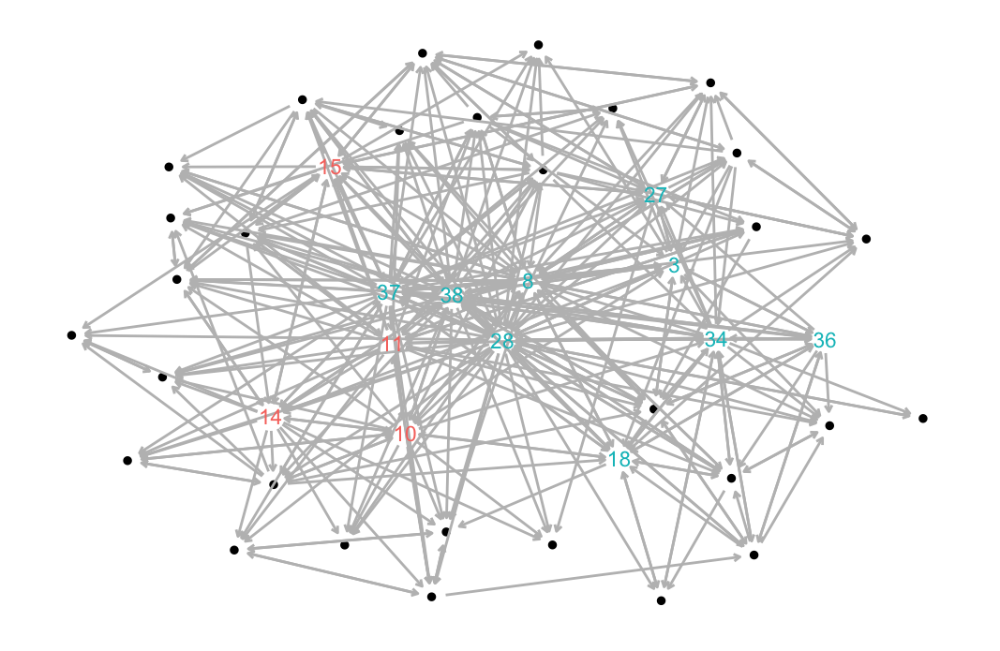

```{r setup, echo=FALSE}
knitr::opts_chunk$set(echo = FALSE)
```

## Executive Overview

<p>The portfolio below captures the coursework I've completed toward developing skills in a systems approach to instructional design. This approach, weighted heavily in data-informed decision-making, places emphasis on empowering students as they drive the pace and scope of their learning journey. Today's digital learning networks are individualized and networked, while also existing both locally and globally. This educational environment requires learners to be as comfortable in the digital world as they are in the physical classroom. The course and artifact summaries below depict how I used these realities as a blueprint to develop knowledge and skills in guiding K-12, post-secondary, and even industry education programs to realize positive individual and organizational growth through effective technology integration.

</p>

<p>While I frontloaded the Learning Analytics certificate courses into my first fall and spring semesters, I attempted to spread the design and leadership courses across multiple semesters to better diversify my personal learning network throughout the program. This allowed me to take insights from design and leadership classes and apply them to my core work on analytics and inquiry. As a result, my foundation in data science was better informed by the challenges faced in developing and delivering quality content for the modern digital classroom. To this end, my inquiry projects focused on exploring the challenges of critical thinking, digital and media literacy, evaluation metrics, and communication across learning networks. The key insights I'm taking from how I organized my learning is that today's education space is overwhelmingly digital, it's social, and it's evolving.

</p>

<p>The digital nature of education is producing a ton of data. While this can be overwhelming if an organization is unprepared, the LA program instilled a data science mindset to solve these types of challenges. From identifying and collecting the right data to understanding its potential significance, and finally, to developing models to solve increasingly complex problems, my experience through the core coursework and the summer internship provided multiple repetitions to engage these methods as well as develop relationships with more experienced practitioners.

</p>

<p>Participating in this program post-pandemic allowed me to benefit from many of my peers' experiences in hybrid learning environments. From equipment and infrastructure shortfalls to learner anxieties about being on camera, I got to hear firsthand how some districts/programs rose to the occasion while others floundered. In both cases, not all students had the same experiences as their peers next to them in class or online. The digital divide is real and not just happening in rural communities. Last spring, I participated in the datathon hosted by NCSU and the Governor's office. That experience opened my eyes to the lack of digital reach and equity across our state. Part of that challenge is recognizing how technology, connectivity infrastructure, and socioeconomics all combine to impact individual students very differently. District and state educational leaders must develop a strategic vision of how to apply resources to ensure each student has the same opportunities regardless of location or personal situation.

</p>

<p>The portfolio is depicted chronologically as I took the courses beginning in the Summer of 2021. Each entry contains a brief description of the course purpose, expected outcomes, and requirements. Also included are key artifacts contributing to my learning goals as well as some examples of additional classwork.

</p>

## [ECI 511: Introduction to Learning Design and Technology](http://catalog.ncsu.edu/search/?P=ECI%20511)

::: float-left


This course provided an overview of the Learning, Design, and Technology master's program at NC State University and to the field of instructional design and educational technology, with an investigation of relevant careers, important theories and models guiding practice, and noteworthy research findings by area. Learning activities included reading assignments, design projects, videos, discussion forums, and individual projects. Students were assessed through asynchronous discussions, online participation, and homework assignments.

<p>

**Key Artifact**:

[Annotated Bibliography - Digital Literacy](https://github.com/jmhardaw/LDT-portfolio/blob/main/content/eci511-artifacts/ECI511-annotated-bibliography.pdf)

[](https://github.com/jmhardaw/LDT-portfolio/blob/main/content/eci511-artifacts/ECI511-annotated-bibliography.pdf)

This assignment was one of the final projects for my introduction to
learning design. The annotated bibliography helped develop my inquiry and research skills as it required me to evaluate the quality of each of the selected resources. As we were allowed to select our own research topic, I focused on how digital literacy impacts learning design methodologies. My goal was to hone my skills at discriminating between relevant, meaningful sources and those that were not. I chose to explore both Google Scholar and the NC State library to increase the chances of locating quality articles. Though the project scope was limited to only five annotations, this assignment greatly helped in developing my initial research interest in digital literacy. The main takeaway from this review reinforced that students who are more interested in the learning material, show a greater desire to increase their digital literacy skills. While short, the review implied a link between quality learning technology integration and digital literacy aptitude.

</p>
:::

<aside>

**Semester Completed**:

-   Summer II 2021

**Instructor**:

-   [Dr. Julia McKeown](https://ced.ncsu.edu/people/jomckeow/)

**Additional Coursework**:

-   [Zoom Training Video](https://www.youtube.com/watch?v=YDljgFQVcOk)
-   [Project - State Park Employee Training Program](https://github.com/jmhardaw/LDT-portfolio/blob/main/content/eci511-artifacts/ECI511-design-project.pdf)

</aside>

`r htmltools::br()`

## [ECI 517: Theoretical Foundations of Advanced Learning Environments](http://catalog.ncsu.edu/search/?P=ECI%20517)

::: float-left


This course provided us with the distinctions and concepts necessary to apply various theories of learning, cognition, and instruction to traditional and distance learning settings. This course introduced and illustrated the proper use of these tools in providing insights into defining and solving problems. The emphasis was on the use of these theories to solve realistic and relevant problems drawn from my personal experience or from cases we studied. Learning activities included reading assignments, design projects, videos, discussion forums, and individual projects.

::: float-left
<p>

**Key Artifact**:

[Final Theory Paper - Agency Drives Growth](https://github.com/jmhardaw/LDT-portfolio/blob/main/content/eci517-artifacts/ECI517-final-theory-paper.pdf)

[{width="200"}](https://github.com/jmhardaw/LDT-portfolio/blob/main/content/eci517-artifacts/ECI517-final-theory-paper.pdf)

This theory paper completed my 15-week journey to better understand which instructional design theories I would pull from to develop my personal learning model. Early in the semester, I wrote my initial thoughts on learning, so this was a follow-up based on almost 4 months of instructional design theory from the past 100 years or so. This course presented opportunities to explore my own
thoughts, feelings, and biases on how teachers affect the relationship between their students and the institution of education. Beyond teaching students how to understand the world around them, educators shape individual trajectories by reinforcing scholarship as a lifelong adventure most often occurring outside
the traditional classroom. This paper reflects how my views on instruction shifted from focusing on learning capability to a more systems perspective of how learners grow as their environment changes. I'm firmly planted in the constructivist camp, which was seen through the learning network diagram I developed as well
as the pillars of my learning theory: self-aware, ownership (agency), complexity, multi-mode, and collaboration.

</p>
:::
:::

<aside>

**Semester Completed**:

-   Fall 2021

**Instructor**:

-   [Dr. Julia McKeown](https://ced.ncsu.edu/people/jomckeow/)

**Additional Coursework**:

-   [Initial Learning Theory Paper](https://github.com/jmhardaw/LDT-portfolio/blob/main/content/eci517-artifacts/ECI517-initial-theory-paper.pdf)
-   [Reflexive Essay - Theories of Learning & Instruction](https://github.com/jmhardaw/LDT-portfolio/blob/main/content/eci517-artifacts/ECI517-reflexive-paper.pdf)
-   [Application Essay - An Intro to R](https://github.com/jmhardaw/LDT-portfolio/blob/main/content/eci517-artifacts/ECI517-application-paper.pdf)

</aside>

`r htmltools::br()`

## [ECI 586: Introduction to Learning Analytics\*](http://catalog.ncsu.edu/search/?P=ECI%20586)

::: float-left


As the use of digital resources continues expand in education, an unprecedented amount of new data is becoming available to educational researchers and practitioners. In response, Learning Analytics (LA) has emerged over the past decade as an interdisciplinary field encompassing Learning (e.g. educational technology, learning and assessment sciences), Analytics (e.g. visualization, computer/data sciences), and Human-Centered Design (e.g. usability, participatory design). This course provided an overview of the field, examples of its use in educational contexts, and applied experience with widely adopted tools and techniques for working with and exploring data. As students gained experience in the collection, analysis, and reporting of data throughout the course, they were better prepared to help educational organizations understand and improve learning and the contexts in which learning occurs.
:::

<aside>

**Semester Completed**:

-   Fall 2021

**Instructor**:

-   [Dr. Shaun Kellogg](https://ced.ncsu.edu/people/sbkellog/)

**Coursework Examples**:

-   [Case Study: Predicting Student Achievement](https://rpubs.com/jmhardaw/StudentAchieve)
-   [Case Study: Identifying At-Risk Students](https://rpubs.com/jmhardaw/At-risk-students)
-   [Shiny App Exercise: Class Enrollment & Gender](https://ps53zd-james-hardaway.shinyapps.io/class-attendance/)
-   [Case Study: Public Sentiment & State Standards](https://rpubs.com/jmhardaw/sentiment-analysis)
-   [Final Project: Benchmarking Fake News](https://rpubs.com/jmhardaw/FinalProject_ECI586)

</aside>

`r htmltools::br()`

## [ECI 587: Machine Learning in Education\*](http://catalog.ncsu.edu/search/?P=ECI%20587)

::: float-left
[{width="200"}](https://wordstream-files-prod.s3.amazonaws.com/s3fs-public/machine-learning.png)

Machine Learning is concerned with computer programs that enable the behavior of a computer to be learned from examples or experience rather than dictated through rules written by hand. This class taught the practical side of machine learning for applications in mining educational data. There was a heavy project focus, and upon completing the course, we were fully prepared to attack new problems using machine learning in the field of education. We covered a wide range of learning algorithms that can be applied to a variety of educational problems. In particular, we discussed topics such as decision trees, rule-based classification, support vector machines, Bayesian networks, and clustering. In addition to readings from the course textbook, we had additional readings from research articles that were distributed on [Moodle](https://delta.ncsu.edu/learning-technology/instructional-tools/moodle/).
:::

<aside>

**Semester Completed**:

-   Fall 2021

**Instructor**:

-   [Dr. Shiyan Jiang](https://ced.ncsu.edu/people/sjiang24/)

**Coursework Examples**:

-   [Final Project: Identifying Misinformation in the Media](https://github.com/jmhardaw/LDT-portfolio/blob/main/content/eci587-artifacts/eci587-final-project.pdf)

</aside>

`r htmltools::br()`

## [ECI 516: Design and Evaluation of Instructional Materials](http://catalog.ncsu.edu/search/?P=ECI%20516)

::: float-left


This course introduces students to the systems approach to instructional design and provides introductory information and application of skills and techniques necessary in the analysis, design, development, implementation, and evaluation of instruction (often referred to as the ADDIE framework). These skills are particularly useful for efficient and cost-effective development of solutions to novel instructional problems. The emphasis is on the development of materials-centered instruction (as opposed to teacher-mediated), that is, materials and resources that are developed to be the primary means by which instruction is delivered. Contrasting views and perspectives of instructional design will be considered, such as those based on very different learning philosophies (such as objectivism and constructivism). This online course delivered all learning materials, activities, and assignments, through [Moodle](https://delta.ncsu.edu/learning-technology/instructional-tools/moodle/), a secure and easy-to-use online learning platform. The course was completely asynchronous, meaning students had no real-time class meeting requirements. Learning activities included reading assignments, design projects, videos, discussion forums, and individual projects. This course consisted of 15 course weeks. Each unit began on Monday and ended the following Sunday. Assignments were due by midnight on Sunday.
:::

<aside>

**Semester Completed**:

-   Spring 2022

**Instructor**:

-   [Dr. Caitlin McKeown](https://moodle-courses2122.wolfware.ncsu.edu/user/view.php?id=28503&course=6365)

**Coursework Examples**:

-   [System Analysis Paper](https://github.com/jmhardaw/LDT-portfolio/blob/main/content/eci516-artifacts/ECI516-system-analysis-paper.pdf)
-   [Needs Analysis Proposal](https://github.com/jmhardaw/LDT-portfolio/blob/main/content/eci516-artifacts/ECI516-needs-analysis-proposal.pdf)
-   [ISD Model Proposal](https://github.com/jmhardaw/LDT-portfolio/blob/main/content/eci516-artifacts/ECI516-isd-process-paper.pdf)

</aside>

`r htmltools::br()`

## [ECI 588: Text Mining in Education\*](http://catalog.ncsu.edu/search/?P=ECI%20588)

::: float-left


As the use of digital resources continues expand in education, an unprecedented amount of new data is becoming available to educational researchers and practitioners. Among these new data sources, unstructured data such as text represents a significant share. This introductory course to text mining is designed to prepare researchers and practitioners to use this data more efficiently, effectively, and ethically. This course will provide students with an overview of text mining as an analytical approach, examples of its use in educational contexts, and applied experience with widely adopted tools and techniques. As participants gain experience in the collection, analysis, and reporting of data throughout the course, they will be better prepared help educational organizations understand and improve both online and blended learning environments. Students develop practical skills in the collection, analysis, and reporting of text data form sources such as Learning Management Systems, social media, and other online sources. Students complete projects using a programming approach with R, a popular free open source software program for data science, or using non-programming point-and-click tools (i.e., SAS Visual Text Analytics or Tableau).
:::

<aside>

**Semester Completed**:

-   Spring 2022

**Instructor**:

-   [Dr. Shiyan Jiang](https://ced.ncsu.edu/people/sjiang24/)

**Coursework Examples**:

-   [Assessing Sentiment: #Python vs. #Rstats Tweets](https://rpubs.com/jmhardaw/python_vs_rstats)
-   [Topic Modeling: Amazon Book Reviews](https://rpubs.com/jmhardaw/eci-588-unit3-book-reviews)
-   [Word Net Analysis: Text Networks Predicting Wordle Success](https://rpubs.com/jmhardaw/eci588-unit-4-analysis)
-   [Final Project: Short Text Topic Modeling](https://rpubs.com/jmhardaw/eci588-final-project)

</aside>

`r htmltools::br()`

## [ECI 589: Analyzing Learning Networks\*](http://catalog.ncsu.edu/search/?P=ECI%20589)

::: float-left


Although social network analysis and its educational antecedents date back to the early 1900s, the popularity of social networking sites like Twitter and Facebook have raised awareness of and renewed interests in networks and their influence. As the use of digital resources continues expand in education, data collected by these educational technologies has also greatly facilitated the application of network analysis to teaching and learning. This introductory course is designed to prepare education researchers and practitioners to apply network analysis to better understand and improve student learning and the contexts in which learning occurs. This course provides students with an overview of social network theory, examples of network analysis in educational contexts, and applied experience with widely adopted tools and techniques. As participants gain experience in the collection, analysis, and reporting of data throughout the course, they will be better prepared to help educational organizations understand and improve both online and blended learning environments.
:::

<aside>

**Semester Completed**:

-   Spring 2022

**Instructor**:

-   [Dr. Shaun Kellogg](https://ced.ncsu.edu/people/sbkellog/)

**Coursework Examples**:

-   [Visual & Numerical Description: School Administrator Centrality](https://rpubs.com/jmhardaw/eci589-unit2-analysis)
-   [Network Substructures: Comparing Out-degree Communications by Role in MOOC-Eds](https://rpubs.com/jmhardaw/eci-589-unit3-analysis)
-   [Predicting Network Phenomena: Collaboration Dependency on Trust & Gender for School Leaders](https://rpubs.com/jmhardaw/eci589-unit4-analysis)
-   [Social Capital & Network Diffusion: Exposure and Influence on Student Attitudes Regarding STEM](https://rpubs.com/jmhardaw/eci589-unit5-walkthrough)

</aside>

`r htmltools::br()`

## [ECI 515: Cultural Investigations and Technical Representations in Education](http://catalog.ncsu.edu/search/?P=ECI%20515)

::: float-left


This course takes an anthropological-historical focus on applying media and technology as resources and instruments to develop cultural awareness of self and others and to understand diverse cultures. The technology tools and media introduced encourage students to explore cultural identity, values, and differences. The teaching strategies introduced are applicable across content areas and particularly relevant in social studies, English, world languages, and the arts. This course does not take an intercultural focus, introducing strategies to improve intercultural communication, although some of the projects discussed would support communication. This course is also not focused on the culture of technology and how emerging technical innovations are impacting society or prompting cultural change (e.g., surveillance, GMOs, Internet of Things, blockchain).
:::

<aside>

**Semester**:

-   Fall 2022

**Instructor**:

-   [Dr. Florence Martin](https://ced.ncsu.edu/people/fmartin3/)

**Coursework Examples**:

-   [Cultural Curation: Media Anaylysis on Climate Change](https://padlet.com/jmhardaw/ua1ccxxbu71uzb7b)
-   [Personal Identity Text: Luck and Timing](https://arcg.is/1LDbz1)
-   [Global Project Plan: Government Accessibility](https://github.com/jmhardaw/LDT-portfolio/blob/main/content/eci515-artifacts/ECI515_Government_Accessibility.pdf)

</aside>

`r htmltools::br()`

## [ECI 518: Digital Learning Program and Staff Development](http://catalog.ncsu.edu/search/?P=ECI%20518)

::: float-left


This course comprises the study and application of principles related to digital learning program planning, facilities and resource management, and staff development in K-12 settings. It is designed to help prepare future technology facilitators and directors to design, develop, and lead school and/or district technology programs across K-12 levels. Some lessons may translate to higher education or industry technology planning, but the majority of readings and resources in this course are geared toward K-12.
:::

<aside>

**Semester**:

-   Fall 2022

**Instructor**:

-   [Dr. Mark Samberg](https://www.linkedin.com/in/marksamberg/)

**Coursework Examples**:

-   [Digital Age Instructional Framework](https://github.com/jmhardaw/LDT-portfolio/blob/main/content/eci515-artifacts/ECI518_Instructional_Framework.pdf)
-   [NCDLI Rubric Review](https://github.com/jmhardaw/LDT-portfolio/blob/main/content/eci515-artifacts/ECI518_NCDLI_Rubric_Review.pdf)
-   [High School Tech Helpdesk Curriculum](https://github.com/jmhardaw/LDT-portfolio/blob/main/content/eci515-artifacts/ECI518_Helpdesk_Curriculum.pdf)
-   [3D Printer Makerspace Budget](https://github.com/jmhardaw/LDT-portfolio/blob/main/content/eci515-artifacts/ECI518_3dPrinter_Trunk_Budget.pdf)

</aside>

`r htmltools::br()`

## [ECI 652: Field-Based Applications of Learning Design and Technology](http://catalog.ncsu.edu/search/?P=ECI%20652)

::: float-left


This course employs supervised opportunities to design, test, and revise learning design and technology solutions in authentic, field-based settings. This online course delivers all learning materials, activities, and assignments, through Moodle, a secure and easy-to-use online learning platform. The course is completely asynchronous, which means that students have no real-time class meeting requirements. Learning activities include reading assignments, program portfolio, internship or an individual design project.
:::

<aside>

**Semester**:

-   Fall 2022

**Instructor**:

-   [Dr. Julia McKeown](https://ced.ncsu.edu/people/jomckeow/)

**Coursework Examples**:

-   [SCADS Internship Summary](https://github.com/jmhardaw/LDT-portfolio/blob/main/content/eci515-artifacts/ECI652_Internship_Summary.pdf)
-   [LD&T Digital Portfolio](https://www.nerdygi.com/courses.html)

</aside>

`r htmltools::br()`
