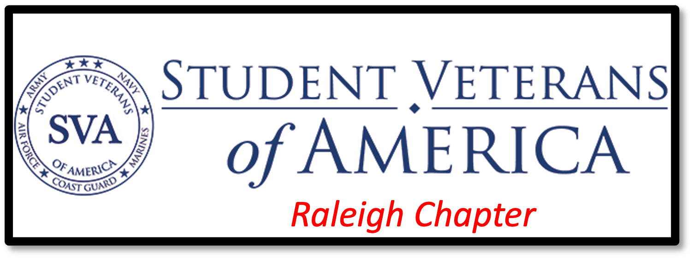

```{r setup, include=FALSE}
knitr::opts_chunk$set(echo = FALSE)
```

```{r deps, include = FALSE, message = FALSE, warning = FALSE}
# Include dependencies here
library(here)
library(knitr)
library(distill)
library(postcards)
library(fontawesome)
library(metathis)
# # Create new post with use_article_template()
# refinery::use_article_template(
#   template = "_templates/standard_post.Rmd",
#   slug = "fabulous-blog-post", 
#   renv_new = TRUE
# )

meta() %>%
  meta_description(
    "The personal website of James Hardaway"
  ) %>%
  meta_name("github-repo" = "jmhardaw/LDT-portfolio") %>%
  meta_viewport() %>%
  meta_social(
    title = "Learning - Innovation - Service",
    url = "https://www.nerdygi.com",
    image = "https://jmhardaw.github.io/LDT-portfolio/images/hardaway-circle.png",
    image_alt = "A photo of James Hardaway",
    og_type = "website",
    og_author = c("James Hardaway"),
    twitter_card_type = "summary",
    twitter_creator = "@James_Hardaway"
  )
```

```{=html}
<style>

d-title {
  display: none!important;
}
.article-header {
  padding-top: 24px;
}
.article-banner {
  width: auto;
  height: auto;
  border: 0;
}
img[src="images/banner.png"] {
  border: 0;
  padding: 0;
  width: 100%;
  margin: 50px 25px 0px 0px;
}
.twitter-border {
 border: 1px dashed black;
 width: 300px;
 position : relative;
 border-radius: 5px;
 margin: 0 auto;
}
.twitter-border::before {
 content: "\f099";
 font-family: "Font Awesome 5 Brands";
 font-weight: 900; 
 font-size: 1.5rem;
 position: absolute;
 top: -15px;
 left: -15px;
}
.twitter-border > p {
  margin-block-start: 0em;
  margin-block-end: 0em;
  margin-bottom: 0em;
}
.home-with-sidebar {
  padding-left: 45px;
  padding-right: 10px;
}
@media (min-width: 1024px) {
  .home-with-sidebar .home-main {
    float: left;
    width: 60%;
  }
}
.home-main {
  margin-top: 10px;
  margin-bottom: 10px;
}
@media (min-width: 1024px) {
  .home-with-sidebar .home-sidebar {
    float: right;
    width: 30%;
    margin-top: 10px;
    padding-top: 24px;
  }
}
.home-sidebar {
  font-size: 16px;
}
.news-container {
  width: 100%;
}
.news-item {
  line-height: 1.45em;
  border-bottom: 1px solid #e3e4F0;
  margin-top: 0px;
  margin-bottom: 0px;
  font-size: 0.9em;
}
.img-item {
	float: left;
	width: 33%;
	padding: 20px
}
.img-container {
	display: flex;
	align-items: center;
  justify-content: center;
  flex-wrap: wrap;
}
.date {
  color: gray;
  display: block;
  font-size: 0.75em;
}
.date::before {
   font-family: "Font Awesome 5 Free";
   font-weight: 900; 
   content: "\f133";
   padding-right: 2px;
}
</style>
```
::: {.home-with-sidebar .l-screen-inset}
::: home-main
## *Learning -- Innovation -- Service*

::: news-container
::: news-item
### Welcome to the Nerdy G.I.'s home on the web. I am a veteran, a craft beer & mead enthusiast, and a 1st-year graduate student at [North Carolina State University](https://www.ncsu.edu/). I study learning design with a focus on using technology and data analytics to improve student outcomes. I also serve as a student veteran ambassador to the NCSU [College of Education](https://ced.ncsu.edu/).
::: img-container
<a href="https://nerdygi.com/courses.html"></a>

<a href="https://nerdygi.com/projects.html"></a>

<a href="https://nerdygi.com/veterans.html"></a>
:::
:::

::: news-item
#### Upcoming Events
<ul>
  <li>NCSU Enrollment begins for Fall 2022 term [Mon 28th Mar 2022]{.date} </li>
  <li>Military & Veteran Services Taco Tuesday 12:30-2PM, Register [HERE](https://docs.google.com/forms/d/e/1FAIpQLSd280B8bPW0ejkuXg6aniB9F_MVqEjHpzhVGX0MH4k7Hx-elw/viewform) by 11 Apr @ 2PM [Tue 12th Apr 2022]{.date} </li>
    <li>Military & Veteran Services Game Night 7:30PM @ Witherspoon Student Center Rm. 100, RSVP [HERE](https://docs.google.com/forms/d/e/1FAIpQLSd1sxUfuAjIh1prztD5771TJpTtc-43uz9HEwk1F6KD3VsxLQ/viewform) [Thu 21st Apr 2022]{.date} </li>
  <li>NCSU Last day of classes [Mon 25th Apr 2022]{.date} </li>
  <li>NCSU Reading Days [Tue-Wed 26-27th Apr 2022]{.date} </li>
  <li>NCSU Final Exams [28th Apr-4th May 2022]{.date} </li>
  <li>Military & Veteran Services Year-End Celebration 6-8:30PM @ Lonnie Poole golf Course, RSVP [HERE](https://ncsu.us6.list-manage.com/track/click?u=59cd6a80e7&id=81e5f20121&e=4c2273589a) [Fri 29th Apr 2022]{.date} </li>
    <li>Military & Veteran Services Family Fun Day 12-4PM (details coming soon) [Sat 30th Apr 2022]{.date} </li>
  <li>NCSU Spring Grades Due [Fri 6th May 2022]{.date} </li>
  <li>NCSU Spring [Commencement](https://commencement.ncsu.edu/) Exercises [Sat 7th May 2022]{.date} </li>
  <li>2022 NC STRIVE Conference hosted by Fayetteville State University, details can be found [HERE](https://ncsu.us14.list-manage.com/track/click?u=379a0da7c16db70ace5ed62f8&id=bb406c2013&e=c1b450074d) [Wed 11th May 2022]{.date} </li>
</ul>
:::
:::

:::
::: home-sidebar
::: twitter-border
<a class="twitter-timeline" data-height="600" data-width="300"  href="https://twitter.com/James_Hardaway?ref_src=twsrc%5Etfw">Tweets by James_Hardaway</a>
:::

```{=html}
<script async src="https://platform.twitter.com/widgets.js" charset="utf-8"></script>
```

<center>
<a href="https://veterans.ncsu.edu/"></a>
</center>
<center>
<a href="https://getinvolved.ncsu.edu/organization/sva"></a>
</center>
<center>
<a href="https://www.youtube.com/channel/UCbV8EkbZG-dj4-APd-NuFVg"></a>
</center>

:::
:::

<center>Visitors<center>
<center>
<div id="sfchc8m4gg883alddgap1pbyl575rdhs6e9"></div>
<script type="text/javascript" src="https://counter7.stat.ovh/private/counter.js?c=hc8m4gg883alddgap1pbyl575rdhs6e9&down=async" async></script>
<br><a href="https://www.freecounterstat.com">website counter</a><noscript><a href="https://www.freecounterstat.com" title="website counter"></a></noscript>
</div></center>