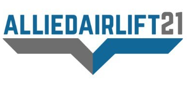

```{r setup, include=FALSE}
knitr::opts_chunk$set(echo = FALSE)
```

## Crisis

::: {l-center}
<ul>

::: float-right
<a href="https://www.veteranscrisisline.net/"></a> [VA Suicide Hotline](https://www.veteranscrisisline.net/) -- 800-273-8255 (online ***chat*** available at link)<br> [NVF Lifeline for Vets](https://nvf.org/lifeline-vets) -- 888-777-4443
:::

</ul>
:::

## Community

::: l-page
+------------------------------------------------------------------------------------------------+--------------------------------------------------------------------------------------------------------------------------------------------------------------------------------------------------------------------------------------------------------------------------------------------------------------------------------------------------------------------------------------------------------------------------------+
|                                                                                                |                                                                                                                                                                                                                                                                                                                                                                                                                                |
+------------------------------------------------------------------------------------------------+--------------------------------------------------------------------------------------------------------------------------------------------------------------------------------------------------------------------------------------------------------------------------------------------------------------------------------------------------------------------------------------------------------------------------------+
| [{width="80" height="37"}](https://www.alliedairlift21.org/)         | [AlliedAirlift21](https://www.alliedairlift21.org/) - operates the Afghan Ally Registry, a secure list of individuals and families under threat who are seeking evacuation from Afghanistan. Coordinating with their U.S. sponsors, they assist in validating and completing documentation for State Department review, and work with partnering organizations assisting in this effort.                                       |
+------------------------------------------------------------------------------------------------+--------------------------------------------------------------------------------------------------------------------------------------------------------------------------------------------------------------------------------------------------------------------------------------------------------------------------------------------------------------------------------------------------------------------------------+
| [{width="80" height="21"}](https://www.legion.org/)                 | [American Legions](https://www.legion.org/) -- "Focusing on service to veterans, service members and communities, The American Legion currently has about 2.4 million members in 14,000 posts worldwide."                                                                                                                                                                                                                      |
+------------------------------------------------------------------------------------------------+--------------------------------------------------------------------------------------------------------------------------------------------------------------------------------------------------------------------------------------------------------------------------------------------------------------------------------------------------------------------------------------------------------------------------------+
| [{width="65" height="83"}](https://www.feedourvets.org/)         | [Feed Our Vets](https://www.feedourvets.org/) -- Since 2008, Feed Our Vets has provided free food assistance to more than 20,000 veterans and their family members, distributing 445,000 lbs. of food.                                                                                                                                                                                                                         |
+------------------------------------------------------------------------------------------------+--------------------------------------------------------------------------------------------------------------------------------------------------------------------------------------------------------------------------------------------------------------------------------------------------------------------------------------------------------------------------------------------------------------------------------+
| [{width="80" height="20"}](https://iava.org/)                         | [Iraq and Afghanistan Veterans of America](https://iava.org/) -- IAVA's mission is to unite, empower and connect post-9/11 veterans through education, advocacy, and community. Its programs include non-partisan advocacy on Capitol Hill, data-driven research on post-9/11 veteran issues, veterans transition assistance, and community building.                                                                          |
+------------------------------------------------------------------------------------------------+--------------------------------------------------------------------------------------------------------------------------------------------------------------------------------------------------------------------------------------------------------------------------------------------------------------------------------------------------------------------------------------------------------------------------------+
| [{width="80"}](https://www.maketheconnection.net/)              | [Make the Connection](https://www.maketheconnection.net/) -- An online resource designed to connect veterans, their family members and friends, and other supporters with information, resources, and solutions to issues affecting their lives.                                                                                                                                                                               |
+------------------------------------------------------------------------------------------------+--------------------------------------------------------------------------------------------------------------------------------------------------------------------------------------------------------------------------------------------------------------------------------------------------------------------------------------------------------------------------------------------------------------------------------+
| [{width="80"}](https://www.militaryonesource.mil/)            | [Military OneSource](https://www.militaryonesource.mil/) -- Both a call center and a website, the program provides comprehensive information, referral and assistance on every aspect of military life 24 hours a day, 7 days a week to all component members of the Armed Forces, their Family members, and survivors. The program is accessible worldwide via the toll-free telephone number ( 800-342-9647) or the website. |
+------------------------------------------------------------------------------------------------+--------------------------------------------------------------------------------------------------------------------------------------------------------------------------------------------------------------------------------------------------------------------------------------------------------------------------------------------------------------------------------------------------------------------------------+
| [{width="74"}](https://www.missioncontinues.org/)                | [The Mission Continues](https://www.missioncontinues.org/) -- Empowering veterans facing the challenge of adjusting to life at home to find new missions. We redeploy veterans in their communities, so that their shared legacy will be one of action and service. Through the Mission Continues, veterans serve their country in new ways by engaging in our innovative and action-oriented programs.                        |
+------------------------------------------------------------------------------------------------+--------------------------------------------------------------------------------------------------------------------------------------------------------------------------------------------------------------------------------------------------------------------------------------------------------------------------------------------------------------------------------------------------------------------------------+
| [{width="80"}](https://www.nvlsp.org/)                               | [National Veterans Legal Services Program](https://www.nvlsp.org/) -- "The NVLSP is a nonprofit organization that has worked since 1980 to ensure that the government delivers to our nation's 25 million veterans and active duty personnel the benefits to which they are entitled because of disabilities resulting from their military service to our country."                                                            |
+------------------------------------------------------------------------------------------------+--------------------------------------------------------------------------------------------------------------------------------------------------------------------------------------------------------------------------------------------------------------------------------------------------------------------------------------------------------------------------------------------------------------------------------+
| [{width="79" height="83"}](https://www.nextstepservicedogs.org/) | [Next Step Service Dogs](https://www.nextstepservicedogs.org/) -- Mission: "to empower positive change for veterans with invisible disabilities such as post-traumatic stress disorder (PTSD) and traumatic brain injury (TBI) through the use of expertly-trained service dogs."                                                                                                                                              |
+------------------------------------------------------------------------------------------------+--------------------------------------------------------------------------------------------------------------------------------------------------------------------------------------------------------------------------------------------------------------------------------------------------------------------------------------------------------------------------------------------------------------------------------+
| [{width="80"}](https://qlplus.org/)                                     | [QL+ Quality of Life+](https://qlplus.org/) -- Greater independence for injured and ill veterans and first responders to overcome daily challenges and get back to the activities they love. [Program Overview](https://nvf.org/wp-content/uploads/2021/04/QLProgOverview-2-26-21.pdf) and [Flyer](https://nvf.org/wp-content/uploads/2021/04/QL-ChallengerFlyer-2-24-21.pdf).                                                 |
+------------------------------------------------------------------------------------------------+--------------------------------------------------------------------------------------------------------------------------------------------------------------------------------------------------------------------------------------------------------------------------------------------------------------------------------------------------------------------------------------------------------------------------------+
| [{width="80"}](https://www.studentveterans.org/)                       | [Student Veterans of America](https://www.studentveterans.org/) -- SVA provides military veterans with the resources, support, and advocacy needed to succeed in higher education and following graduation.                                                                                                                                                                                                                    |
+------------------------------------------------------------------------------------------------+--------------------------------------------------------------------------------------------------------------------------------------------------------------------------------------------------------------------------------------------------------------------------------------------------------------------------------------------------------------------------------------------------------------------------------+
| [{width="80"}](https://teamrwb.org/)                              | [Team Red, White, and Blue](https://teamrwb.org/) -- "Team RWB's mission is to enrich the lives of America's veterans by connecting them to their community through physical and social activity."                                                                                                                                                                                                                             |
+------------------------------------------------------------------------------------------------+--------------------------------------------------------------------------------------------------------------------------------------------------------------------------------------------------------------------------------------------------------------------------------------------------------------------------------------------------------------------------------------------------------------------------------+
| [{width="80"}](https://www.teamrubiconusa.org/)                    | [Team Rubicon](https://www.teamrubiconusa.org/) -- "Team Rubicon unites the skills and experiences of military veterans with first responders to rapidly deploy emergency response teams."                                                                                                                                                                                                                                     |
+------------------------------------------------------------------------------------------------+--------------------------------------------------------------------------------------------------------------------------------------------------------------------------------------------------------------------------------------------------------------------------------------------------------------------------------------------------------------------------------------------------------------------------------+
| [{width="80"}](https://www.carolinasveterans.org/)            | [VetCarolinas](https://www.carolinasveterans.org/) -- an unincorporated group chartered to make the Carolinas the premier destination for veterans. VetCarolinas will network with Carolinas' communities to find those organizations with like-minded values who may have opportunities for veterans, including but not limited to businesses, academia, non-profit groups and government organizations.                      |
+------------------------------------------------------------------------------------------------+--------------------------------------------------------------------------------------------------------------------------------------------------------------------------------------------------------------------------------------------------------------------------------------------------------------------------------------------------------------------------------------------------------------------------------+
| [{width="80" height="27"}](https://www.vfw.org/)                       | [Veterans of Foreign Wars](https://www.vfw.org/) -- VFW Mission: "To foster camaraderie among United States veterans of overseas conflicts. To serve our veterans, the military, and our communities. To advocate on behalf of all veterans."                                                                                                                                                                                  |
+------------------------------------------------------------------------------------------------+--------------------------------------------------------------------------------------------------------------------------------------------------------------------------------------------------------------------------------------------------------------------------------------------------------------------------------------------------------------------------------------------------------------------------------+
| [{width="80" height="71"}](https://www.vetslegal.com/)          | [Veterans Legal Institute](https://www.vetslegal.com/) -- "Veterans Legal Institute (VLI) seeks to provide pro bono legal assistance to homeless and low income current and former service members so as to eradicate barriers to housing, education, employment and healthcare and foster self-sufficiency."                                                                                                                  |
+------------------------------------------------------------------------------------------------+--------------------------------------------------------------------------------------------------------------------------------------------------------------------------------------------------------------------------------------------------------------------------------------------------------------------------------------------------------------------------------------------------------------------------------+
| [{width="80"}](https://vetsfwd.org/)                      | [Veterans Moving Forward](https://vetsfwd.org/) -- They provide service dogs to veterans with physical and behavioral health concerns.                                                                                                                                                                                                                                                                                         |
+------------------------------------------------------------------------------------------------+--------------------------------------------------------------------------------------------------------------------------------------------------------------------------------------------------------------------------------------------------------------------------------------------------------------------------------------------------------------------------------------------------------------------------------+
:::

## Digital Literacy & Hygiene

::: l-page
<ul>

<li>

[Media Bias / Fact Check](https://mediabiasfactcheck.com/) -- The mission of MBFC is to educate the public on media bias and deceptive news practices. They are an independent website that rates the bias, factual accuracy, and credibility of media sources. Their purpose is to give people the resources and tools needed to understand the bias and credibility of the sources they consume.

</li>

<li>

[The News Literacy Project](https://newslit.org/) -- a nonpartisan national education nonprofit, provides programs and resources for educators and the public to teach, learn and share the abilities needed to be smart, active consumers of news and information and equal and engaged participants in a democracy.

</li>

<li>

[Ultimate Guide to Internet Safety](https://www.internetadvisor.com/internet-safety-guide) -- [InternetAdvisor](https://www.internetadvisor.com/) has compiled this free guide on the latest potential threats on the internet. This resource details simple but effective strategies that can be implemented to protect you or anyone in your family while on the web.

</li>

</ul>
:::

## Education

::: l-page
<ul>

<li>

[Army Continuing Education System](https://home.army.mil/imcom/index.php/professionals/human-services/aces)

</li>

<li>

[Marine Corps Voluntary Education Program](http://www.usmc-mccs.org/services/education/voluntary-education/)

</li>

<li>

[Navy College Program](https://www.navycollege.navy.mil/)

</li>

<li>

[Air Force Military Tuition Assistance Program](https://www.afpc.af.mil/Benefits-and-Entitlements/Military-Tuition-Assistance-Program/) and [Community College of the Air Force](https://www.airuniversity.af.edu/Barnes/CCAF/)

</li>

<li>

[Coast Guard Institute](https://www.forcecom.uscg.mil/Our-Organization/FORCECOM-UNITS/ETQC/Voluntary-Education/)

</li>

<li>

[Jeffrey Wright Military and Veteran Services](https://veterans.ncsu.edu/) (NC State University) -- Founded in Fall 2016, Military and Veteran Services coordinates a campus-wide effort to ensure that military-connected students are able to successfully access important campus and community resources and support with ease. Our office serves as the University's central location to provide specialized programs and services to over 2,500 veterans, active duty military, National Guard/Reserve, and their families.

</li>

<li>

[College Navigator](https://nces.ed.gov/collegenavigator/) -- This tool from the National Center for Education Statistics can help you choose the right school with information about more than 7,000 institutions. Compare tuition, financial aid statistics, credit transfer and more.

</li>

<li>

[Tuition Assistance or TA DECIDE](https://www.dodmou.com/TADECIDE) -- Make informed decisions about your education. Compare schools, tuition and fees, programs, assistance available and more with the TA DECIDE tool from the Department of Defense.

</li>

<li>

[Department of Veterans Affairs education and training benefits](https://www.va.gov/education/) -- The VA website connects you to information about education, the GI Bill® and job training programs for service members and veterans.

</li>

<li>

[Federal Student Aid](https://studentaid.gov/) -- This U.S. government website provides information and resources for college students and their families to help them choose the right college, apply for financial aid and repay student loans.

</li>

<li>

[Department of Education](https://www.ed.gov/) -- This U.S. government website provides information for students, parents, teachers and administrators, including links related to student aid, grants and scholarships.

</li>

<li>

[GI Bill® Comparison Tool](https://www.va.gov/gi-bill-comparison-tool) -- This tool helps you compare VA-approved institutions and review other information to choose the right school. It's also helpful for applying GI Bill® benefits to an on-the-job training program.

</li>

<li>

[Career Path DECIDE](https://careerpathdecide.usalearning.gov/career-planning/quick-match) -- Service members and veterans can use this online tool to find best-fit careers based on their military occupation, education level and prior experience, as well as the required credentials or degrees.

</li>

<li>

[Postsecondary Education Complaint System](https://www.militaryonesource.mil/education-employment/for-service-members/choosing-a-college/postsecondary-education-complaint-system) -- If you or your spouse receive tuition assistance or are a [My Career Advancement Account Scholarship](https://www.militaryonesource.mil/education-employment/for-spouses/mycaa-scholarship/) recipient and feel you have received mistreatment by an educational institution, you are encouraged to submit your feedback through PECS.

</li>

</ul>
:::

## Employment

::: l-page
<ul>

<li>

[American Job Centers](https://www.servicelocator.org/) -- America's Service Locator connects individuals to employment and training opportunities available at local American Job Centers. The website provides contact information for a range of local work-related services, including unemployment benefits, career development, and educational opportunities.

</li>

<li>

[CareerOneStop](https://www.careeronestop.org/Site/veterans.aspx) -- This Department of Labor website can connect you with programs, including the Veteran and Military Transition Center or My Next Move for Veterans. Also, explore careers, find benefits information and locate your nearest [American Job Center](https://www.careeronestop.org/LocalHelp/AmericanJobCenters/american-job-centers.aspx).

</li>

<li>

[Computer/Electronic Accommodations Program](https://www.cap.mil/) -- This program provides assistive technology and accommodations to support individuals with disabilities and wounded, ill and injured service members throughout the federal government. Access information and communication technology which can help you with your job search.

</li>

<li>

[Department of Defense Transition Assistance Program](https://www.dodtap.mil/index.html) -- The place to start for employment planning and career readiness. The website connects you to your service branch, as well as resources and tools.

</li>

<li>

[DOD Skillbridge](https://dodskillbridge.usalearning.gov/) -- This program offers employment training, internship and apprenticeship opportunities at more than 1,000 public and private organizations across the country.

</li>

<li>

[Employment and Training Administration Apprenticeship programs](https://www.dol.gov/agencies/eta/apprenticeship) -- This website from the Department of Labor helps service members and veterans find high-skill, well-paying jobs in the Registered Apprenticeship system.

</li>

<li>

[Feds Hire Vets](https://www.fedshirevets.gov/) -- The federal government-wide employment website provides federal employment information for veterans, transitioning service members, their families and federal hiring officials.

</li>

<li>

[Find a Job](https://www.dol.gov/veterans/findajob/) -- The VA and the Department of Labor have teamed up to offer numerous online resources for veterans and military spouses seeking employment. Get tools, one-on-one assistance, training and more.

</li>

<li>

[Hire Heroes USA](https://www.hireheroesusa.org/about/) -- Hire Heroes offers employment assistance for transitioning military members through personalized service and support.

</li>

<li>

[National Veterans Foundation Job Board](https://jobs.nvf.org/) -- A listing of jobs across the country at companies interesting in hiring veterans.

</li>

<li>

[North Carolina for Military Employment](https://nc4me.org/cpt_services/hiring-events/) -- NC4ME is a comprehensive public-private partnership designed to make NC the number one state for military employment.

</li>

<li>

[Onward to Opportunity](https://ivmf.syracuse.edu/programs/career-training/) -- O2O is a free career training program that provides professional certification and employee support services to transitioning service members, veterans and military spouses.

</li>

<li>

[Patriots Path](https://patriots-path.org/) -- Patriots Path is a non-profit organization that supports veterans, transitioning service members, and military spouses in finding meaningful employment opportunities by defining career goals, mapping out job search strategies, identifying opportunities, creating a marketing approach and connecting within our community to peers, mentors and coaches for continued networking and support.

</li>

<li>

[Small Business (SBA Veteran & Disabled Veterans)](https://www.sba.gov/content/veteran-service-disabled-veteran-owned) -- If you are a veteran or service-disabled veteran, SBA has resources to help you start and grow your small business.

</li>

<li>

[Transition Assistance Program](https://installations.militaryonesource.mil/?looking-for-a=program/program-service=22/focus=program) -- Transition Assistance offices are on most military installations in the United States and overseas. You can also [find service-specific TAP resources](https://www.dodtap.mil/links.html):

</li>

-   [Army Soldier for Life Transition Assistance Program](https://www.sfl-tap.army.mil/)
-   [Marine Corps Transition Readiness Program](https://usmc-mccs.org/services/career/transition-readiness/)
-   [Navy Transition Assistance](https://www.cnic.navy.mil/regions/cnrse/installations/nas_kingsville/ffr/support_services/military_support/transition_assistance.html)
-   [Air Force Transition Assistance Program](https://www.afpc.af.mil/Airman-and-Family/Transition-Assistance-Program/)
-   [Coast Guard Transition Assistance Program](https://www.dcms.uscg.mil/Our-Organization/Assistant-Commandant-for-Human-Resources-CG-1/Health-Safety-and-Work-Life-CG-11/Office-of-Work-Life-CG-111/Transition-Assistance-Program/)

<li>

[USAJOBS](https://www.usajobs.gov/Help/working-in-government/unique-hiring-paths/veterans/) -- The federal government's employment-related website provides helpful links for veterans seeking federal jobs. As the largest federal employer of veterans, the Department of Defense also offers help with connecting veterans to Department of Defense [civil service jobs](https://www.dodciviliancareers.com/).

</li>

<li>

[VA Employment Programs for Homeless Veterans](https://www.va.gov/homeless/employment_programs.asp) -- VA's Compensated Work Therapy (CWT) Program is a national vocational program comprised of three unique programs which assist homeless veterans in returning to competitive employment: Sheltered Workshop, Transitional Work, and Supported Employment. Veterans in CWT are paid at least the federal or state minimum wage, whichever is higher.

</li>

<li>

[VA Vocational Rehabilitation and Employment Home](https://www.benefits.va.gov/vocrehab/) -- Veterans may receive vocational rehabilitation and employment services to help with job training, employment, resume development, and job seeking skills coaching. Other services may be provided to assist veterans in starting their own businesses or independent living services for those who are severely disabled and unable to work in traditional employment.

</li>

</ul>
:::

## Health

::: l-page
<ul>

<li>

[Find A VA Hospital or Clinic](https://www.va.gov/directory/guide/home.asp?isflash=1)

</li>

<li>

[AddictionResource](https://addictionresource.com/addiction/veterans-and-substance-abuse/) -- Addiction Resource was founded in 2014 to provide a community for those recovering from addiction and to help patients find the highest quality care for a successful recovery. Their goal is to provide resources to help patients and their loved ones so that they may stay on the road to recovery, and can successfully overcome addiction for life.

</li>

<li>

[Help.org](https://www.help.org/substance-abuse-rehab-for-veterans/) -- Help.org compiled this "how-to" guide specifically for veterans facing substance abuse. Their guide walks through each step of the process -- from learning about substance abuse treatment programs to accessing treatment. The site also provides additional resources, hotlines, and funding programs to supplement or help make treatment possible.

</li>

<li>

[MemoryCare](https://www.memorycare.com/veterans/) -- MemoryCare.com's mission is to support older adults living with memory impairment and their families by using the latest, data-driven research and collaborating with memory care experts to provide resources that are accessible to all who are in need. Many veterans suffering from Alzheimer's are unaware of the available programs that can help maintain or improve their quality of life. This site explores those resources.

</li>

<li>

[Mesothelioma Center](https://www.asbestos.com/mesothelioma/) -- Veterans account for 30% of the mesothelioma cases diagnosed annually. Specifically at risk are those that served between 1930 and 1980. The Mesothelioma Center at Asbestos.com has a core purpose of advocacy, awareness and connecting people to the best mesothelioma resources.

</li>

<li>

[Mesothelioma Hope](https://www.mesotheliomahope.com/veterans/) -- Founded by a group of medical and legal advocates, Mesothelioma Hope has a goal to provide a comprehensive database for people diagnosed with mesothelioma. Today, Mesothelioma Hope works to assist those directly affected and help families, siblings, and other caregivers provide support.

</li>

<li>

[Mesothelioma Lawyer Center](https://www.mesotheliomalawyercenter.org/veterans/) Veterans Guide -- This guide delivers a history of asbestos use in the military as well as links to support resources for veterans. The Mesothelioma Lawyer Center works to put people diagnosed with mesothelioma and their families in touch with a highly experienced mesothelioma attorney in their area so they have access to their best possible opportunities for financial compensation.

</li>

<li>

[RetireGuide® Medicare Guide for Veterans](https://www.retireguide.com/guides/medicare-for-veterans/) - Veterans can receive both Veteran Affairs (VA) health care benefits and Medicare when they become eligible. This guide assists veterans in enrolling in Medicare so they have more coverage options when seeking care from non-VA health care facilities.

</li>

<li>

[SAMHSA](https://www.samhsa.gov/veterans-military-families) -- SAMHSA's mission is to reduce the impact of substance abuse and mental illness on America's communities. SAMHSA leads efforts to ensure that American servicemen and women and their families can access behavioral health treatment and services. For Addiction Support 24/7 Call SAMHSA: 800-662-4357 (HELP).

</li>

<li>

[VA Care Providers Program](https://www.caregiver.va.gov/) -- For Caregivers of veterans. "VA values your commitment as a partner in our pledge to care for those who have "borne the battle," and we have several support and service options designed with you in mind. The programs are available both in and out of your home to help you care for the veteran you love and for yourself."

</li>

</ul>
:::

## Housing

::: l-page
<ul>

<li>

[Veterans Affairs Supportive Housing](https://www.va.gov/homeless/hud-vash.asp) -- The HUD-VASH program combines Housing Choice Voucher (HCV) rental assistance for homeless veterans with case management and clinical services provided by the Department of Veterans Affairs (VA). VA provides these services for participating veterans at VA medical centers (VAMCs) and community-based outreach clinics.

</li>

<li>

[Supportive Services for Veteran Families](https://www.va.gov/homeless/ssvf/?page=/home/general_program_info_regs) -- Under the SSVF program, VA awards grants to private non-profit organizations and consumer cooperatives who can provide supportive services to very low-income Veteran families living in or transitioning to permanent housing. Grantees provide eligible veteran families with outreach, case management, and assistance in obtaining VA and other benefits. [List of SSVF Providers by State (Excel Doc)](https://www.va.gov/HOMELESS/ssvf/docs/FY2020_SSVF_ProviderList_October2019.xlsx)

</li>

<li>

[Homeless Veteran Stand Downs](https://www.va.gov/homeless/events.asp) -- Stand Downs are typically one- to three-day events providing supplies and services such as food, shelter, clothing, health screenings and VA Social Security benefits counseling to homeless veterans. Veterans can also receive referrals to other assistance such as health care, housing solutions, employment, substance use treatment and mental health counseling. Stand Downs are collaborative events, coordinated between local VA Medical Centers, other government agencies and community-based homeless service providers.

</li>

<li>

[National Coalition for Homeless Veterans](http://www.nchv.org/) -- The NCHV is the resource and technical assistance center for a national network of community-based service providers and local, state and federal agencies that provide emergency and supportive housing, food, health services, job training and placement assistance, legal aid and case management support for hundreds of thousands of homeless veterans each year.

</li>

<li>

[North Carolina DMVA Housing Assistance](https://www.milvets.nc.gov/services/housing-assistance) -- The North Carolina Department of Military and Veterans Affairs has resources available to aid veterans in their housing needs, from immediate assistance for those currently struggling with homelessness to tax credits and exemptions for current homeowners.

</li>

<li>

[AssistedLivingToday](https://assistedlivingtoday.com/blog/assisted-living-veterans-benefits-didnt-know-existed/) -- Another insightful guide on benefits designed for veterans to help alleviate the financial burden that comes with long-term care in an assisted living environment.

</li>

</ul>
:::
